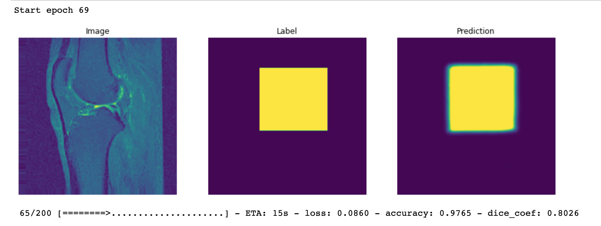

## Implementation of deep learning framework -- Unet, using Keras

The architecture was inspired by [U-Net: Convolutional Networks for Biomedical Image Segmentation](http://lmb.informatik.uni-freiburg.de/people/ronneber/u-net/).

---

## Overview

### Data

You can use your custom data, I used this git for my research work. Data directory should be like this

```
|- Dataset
    |- images
        |- image.jpg
        |- image2.jpg
    |- labels
        |- image.jpg
        |- image2.jpg
```
<br>

### Model


This deep neural network is implemented with Keras functional API, which makes it extremely easy to experiment with different interesting architectures.

Output from the network is a 512*512 which represents mask that should be learned. Sigmoid activation function
makes sure that mask pixels are in \[0, 1\] range.

<br>

### Training

you can use this notebook for training purpose [Notebook Path](trainUnet.ipynb)
    
    1. You can also make your own custom Generator
    2. In this git **zhixuhao** is using flow from directory generator (which takes care of your ram even if dataset is to large)

### Start tensorboard

```bash

conda activate your_env
tensorboard --logdir logs/ --port 6006 --bind_all


```

<br>

### Evaluation

In this git we focused on 

1. dice-coeffecient 


<br>
Now you can see the predicted mask at the time of training so that you know how's your model performing

<br>




<br>

### Dependencies

This tutorial depends on the following libraries:

Run the following bash commands to make a seperate environemnt for this git

1. Install conda first
    ```bash
    conda create -n unet_env python=3.6 tensorflow keras, opencv-python matplotlib 
    conda activate unet_env
    ```


