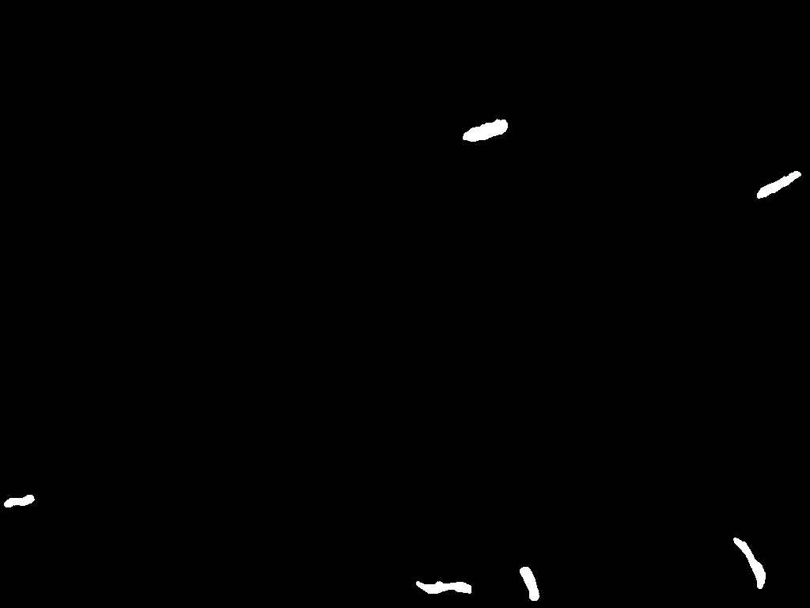
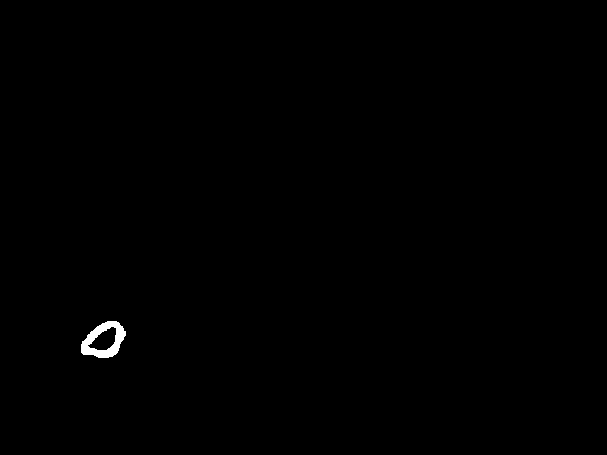
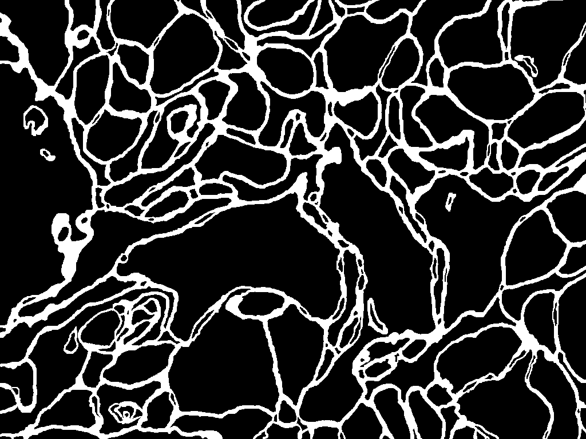
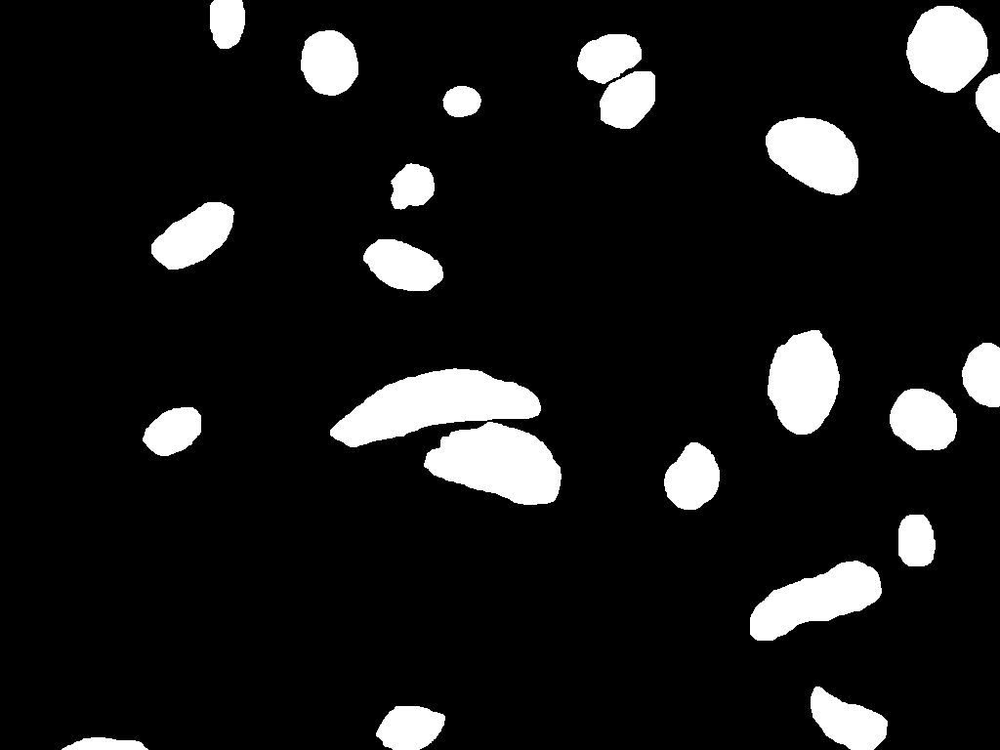
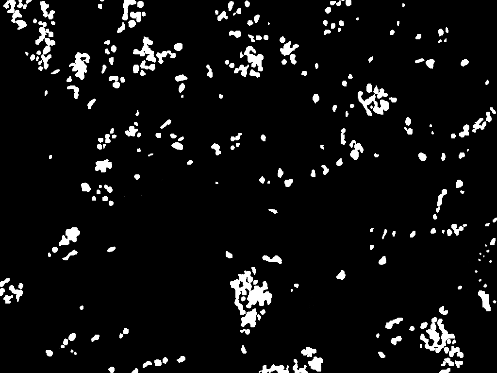

# Implementation of deep learning framework -- Unet, using Keras

The architecture was inspired by [U-Net: Convolutional Networks for Biomedical Image Segmentation](http://lmb.informatik.uni-freiburg.de/people/ronneber/u-net/).

---

## Overview

### Data

The original dataset is from [EPFL electron microscopy dataset](https://www.epfl.ch/labs/cvlab/data/data-em/), and we've downloaded it and done labels.
You can find it in folder data/epfl_train.

### Model

This deep neural network is implemented with Keras functional API, which makes it extremely easy to experiment with different interesting architectures.

Output from the network is a 256*256 which represents mask that should be learned. Sigmoid activation function
makes sure that mask pixels are in \[0, 1\] range.

Also we added batch normalization after each convolution and the ReLU activation layers

### Training

The model is trained for 100 epochs.

Loss function for the training is Dice Loss.

---

## How to use

### Dependencies

This tutorial depends on the following libraries:

* Tensorflow
* Keras >= 1.0

Also, this code should be compatible with Python versions 2.7-3.5.

### Follow notebook trainUnet

### Results

## About Keras

Keras is a minimalist, highly modular neural networks library, written in Python and capable of running on top of either TensorFlow or Theano. It was developed with a focus on enabling fast experimentation. Being able to go from idea to result with the least possible delay is key to doing good research.

Use Keras if you need a deep learning library that:

allows for easy and fast prototyping (through total modularity, minimalism, and extensibility).
supports both convolutional networks and recurrent networks, as well as combinations of the two.
supports arbitrary connectivity schemes (including multi-input and multi-output training).
runs seamlessly on CPU and GPU.
Read the documentation [Keras.io](http://keras.io/)

Keras is compatible with: Python 2.7-3.5.
