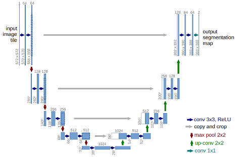
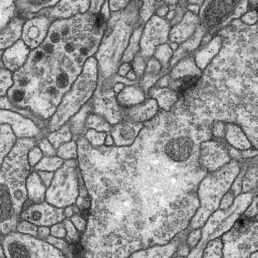
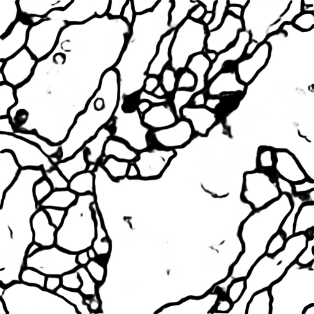

# Implementation of deep learning framework -- Unet, using Keras

The architecture was inspired by [U-Net: Convolutional Networks for Biomedical Image Segmentation](http://lmb.informatik.uni-freiburg.de/people/ronneber/u-net/).

---

## Overview

### Data

[Provided data](http://brainiac2.mit.edu/isbi_challenge/) you can download the train and test data from this server.
you can also find data in the data folder.

### Pre-processing

The images are 3-D volume tiff, you should transfer the stacks into images first.
The data for training contains 30 512*512 images, which are far not enough to feed a deep learning neural network.
To do data augumentation, an image deformation method was used, which was implemented in C++ using opencv.

### Model



This deep neural network is implemented with Keras functional API, which makes it extremely easy to experiment with different interesting architectures.

Output from the network is a 512*512 which represents mask that should be learned. Sigmoid activation function
makes sure that mask pixels are in \[0, 1\] range.

### Training

The model is trained for 10 epochs.

After 10 epochs, calculated accuracy is about 0.97.

Loss function for the training is basically just a binary crossentropy

---

## How to use

### Dependencies

This tutorial depends on the following libraries:

* Tensorflow
* Keras >= 1.0
* libtiff(optional)

Also, this code should be compatible with Python versions 2.7-3.5.

### Prepare the data

First transfer 3D volume tiff to 30 512*512 images.

To feed the unet, data augmentation is necessary.

An [image deformation](http://faculty.cs.tamu.edu/schaefer/research/mls.pdf) method is used, the code is 

availabel in this [repository](https://github.com/cxcxcxcx/imgwarp-opencv).


### Define the model

* Check out ```get_unet()``` in ```unet.py``` to modify the model, optimizer and loss function.

### Train the model and generate masks for test images

* Run ```python unet.py``` to train the model.


After this script finishes, in ```imgs_mask_test.npy``` masks for corresponding images in ```imgs_test.npy```
should be generated. I suggest you examine these masks for getting further insight of your model's performance.

### Results

Use the trained model to do segmentation on test images, the result is statisfactory.






## About Keras

Keras is a minimalist, highly modular neural networks library, written in Python and capable of running on top of either TensorFlow or Theano. It was developed with a focus on enabling fast experimentation. Being able to go from idea to result with the least possible delay is key to doing good research.

Use Keras if you need a deep learning library that:

allows for easy and fast prototyping (through total modularity, minimalism, and extensibility).
supports both convolutional networks and recurrent networks, as well as combinations of the two.
supports arbitrary connectivity schemes (including multi-input and multi-output training).
runs seamlessly on CPU and GPU.
Read the documentation [Keras.io](http://keras.io/)

Keras is compatible with: Python 2.7-3.5.
